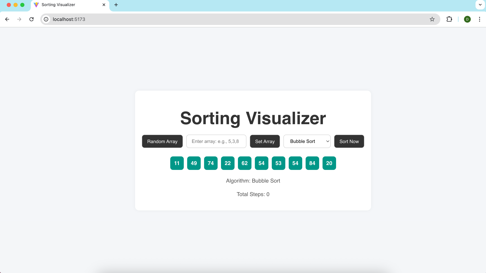

# 🔢 Sorting Algorithm Visualizer

A modern, animated visualization tool to understand how sorting algorithms work — built using **React + Vite**. Supports custom input arrays, step-by-step sorting animations, and tracks the number of iterations (comparisons/swaps).

 
---

## 🚀 Features

- 🔁 Supports multiple sorting algorithms (Bubble, Selection, Insertion)
- 🧠 Visual step-by-step animations (comparisons & swaps)
- 🎨 Modern and responsive UI
- 📥 Accepts user-defined arrays
- 📊 Displays total number of iterations (steps)
- ⚡ Built with Vite for fast dev and build

